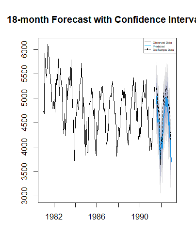
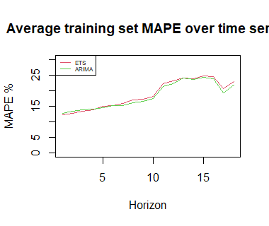

# Business Analytics Report: Time Series Forecasting

This repository presents a comprehensive business analytics report on time series forecasting, utilizing various statistical and machine learning models to analyze and predict future trends. The analysis covers exploratory data insights, forecasting models, evaluation metrics, and actionable business insights.

---

## **Dataset Overview**

The dataset used for this analysis is sourced from the M3 competition dataset, containing various time series data across industries like finance, retail, and manufacturing. Each time series includes:
- **In-sample Data (`x`)**: Historical observations used for model training.
- **Out-of-sample Data (`xx`)**: Future observations used to evaluate forecast accuracy.

Key characteristics of the dataset:
- Varying frequencies (monthly, quarterly, yearly).
- Presence of seasonality and trends.
- Real-world relevance across business domains.


---

## **Methodologies and Models**

### **1. Data Exploration**
- **Objective**: Gain insights into the structure and behavior of time series.
- **Key Steps**:
  - Visualize trends, seasonality, and anomalies using seasonal plots, ACF, PACF, and decomposition.
  - Statistical tests like ADF and KPSS to check stationarity.
  - Outlier detection and summary statistics.


### **2. ARIMA Modelling**
- **Script**: `Manual Arima Modelling.R`
- **Objective**: Build ARIMA models to handle autoregressive and moving average components.
- **Highlights**:
  - Optimal model selected based on AIC and residual diagnostics.
  - Seasonal differencing applied to handle periodic patterns.
- **Key Outputs**:
  - ARIMA(0,1,1)(0,1,1) selected for its accuracy.
  - Forecast comparison with out-of-sample data.



### **3. ETS (Exponential Smoothing) Modelling**
- **Script**: `Manual ETS Modelling.R`
- **Objective**: Model data with exponential smoothing techniques for seasonality and trend.
- **Highlights**:
  - Multiple models tested, including ETS(AAN), ETS(AAA), and ETS(MAM).
  - Model selection based on residuals and forecasting accuracy.
- **Key Outputs**:
  - ETS(MNA) provided the best performance with minimal errors.
  - Prediction intervals visualized for decision-making.



### **4. Regression Modelling**
- **Script**: `Regression Modelling.R`
- **Objective**: Employ regression analysis incorporating trend and seasonal dummy variables.
- **Highlights**:
  - Adjusted R-squared used for model evaluation.
  - Forecasting extended using trend and seasonal components.
- **Key Outputs**:
  - Regression models with seasonality outperformed simpler approaches.
  - Linear regression forecasts visualized against actual data.

### **5. Batch Forecasting**
- **Script**: `Batch Forecasting.R`
- **Objective**: Automate forecasting for multiple time series using ARIMA and ETS models.
- **Highlights**:
  - Parallel processing for efficiency.
  - Dynamic model selection based on out-of-sample accuracy.
- **Key Outputs**:
  - Benchmark results consolidated across series.
  - Performance metrics evaluated for ARIMA, ETS, and baseline models.

---

## **Evaluation Metrics**

To assess the performance and business impact of the models, the following metrics were utilized:

1. **MAPE (Mean Absolute Percentage Error)**:
   - Measures percentage error in forecasts.
   - Lower values indicate better accuracy.

2. **MASE (Mean Absolute Scaled Error)**:
   - Compares errors to a naive baseline.
   - Robust metric for varying scales.

3. **MPE (Mean Percentage Error)**:
   - Highlights bias in forecasts (underestimation or overestimation).

**Visualization of Results**:
- Forecast performance plotted across horizons for all models.
- Summary tables showing model-specific metrics by series type and characteristics.


---

## **Business Insights**

This analysis equips businesses with:
1. **Forecasting Reliability**:
   - ARIMA models excel in data with strong autoregressive components.
   - ETS models are better suited for seasonality-driven series.

2. **Decision Support**:
   - Forecast intervals provide clarity for risk and uncertainty management.
   - Regression models enable scenario analysis with trend and seasonal adjustments.

3. **Efficiency Gains**:
   - Batch forecasting streamlines prediction across large datasets.
   - Automated model selection reduces manual effort.

---

## **Usage Instructions**

### **1. Prerequisites**
Install the required R packages:
```R
install.packages(c("forecast", "tseries", "ggplot2", "fpp2", "smooth", "dplyr", "openxlsx"))
