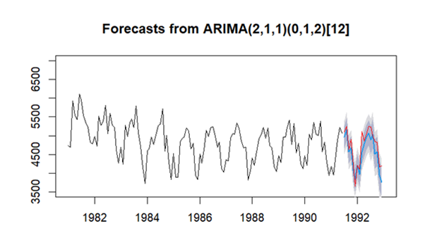
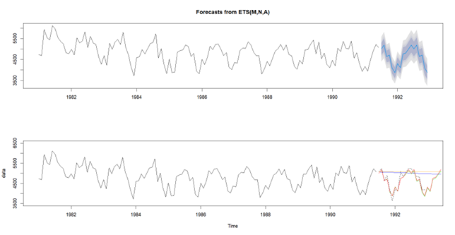
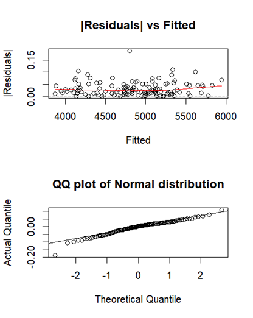
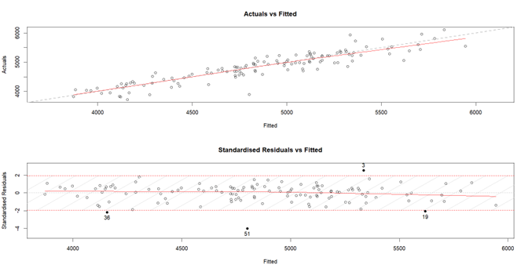
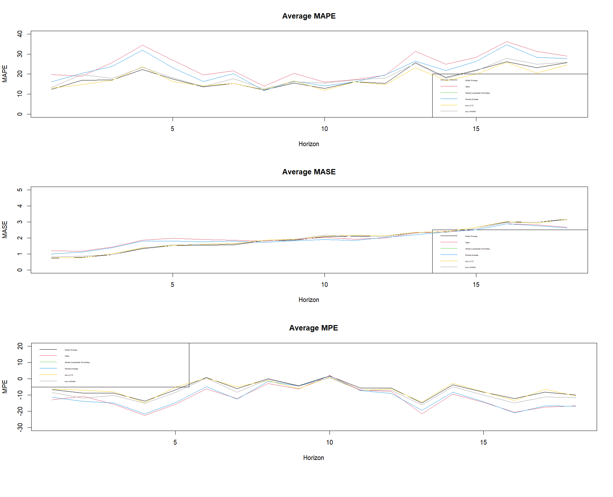

# Comprehensive Time Series Forecasting

This repository presents a detailed time series forecasting analysis using data from the **Makridakis M3 Competition**. The project demonstrates technical expertise in forecasting models such as ARIMA, ETS, and regression, with practical applications in industries like manufacturing, supply chain, and finance.

## 1. Project Overview

The primary goals of this project include:
- **Manual Forecasting**: Applying ARIMA and ETS models to forecast glass container shipments (Series 1910).
- **Batch Forecasting**: Automating model selection (ARIMA vs. ETS) for 100 monthly time series.
- **Real-World Applications**: Providing actionable insights for inventory management, demand forecasting, and operational planning.

---

## 2. Dataset Overview

**Source**: Makridakis M3 Competition dataset  
**Key Characteristics**:
- **In-Sample Data (x)**: Historical observations used for training models.
- **Out-of-Sample Data (xx)**: Future observations reserved for validating forecasts.

**Focus Areas**:
1. **Glass Container Shipments (Series 1910)**: Monthly data from 1981–1992.
2. **Batch Forecasting**: 100 monthly series (1501–2500 ending with '9').

---

## 3. Methodology

### Exploratory Data Analysis (EDA)
- Decomposed time series into seasonal, trend, and residual components using `decompose` and `stl`.
- Identified key metrics such as seasonality, trends, variance, and outliers.

### ARIMA Modeling
- Conducted stationarity tests (ADF, KPSS) and seasonal differencing.
- Best-fit model: **ARIMA(2,1,1)(0,1,2)**.
- Validated results using residual diagnostics (ACF, PACF).

**Visualization**:

### ETS Modeling
- Evaluated multiple ETS models: **MNA**, **AAA**, **MAM**.
- Best-fit model: **MNA**, capturing multiplicative errors and additive seasonality.

**Visualization**:

### Regression Modeling
- Built multiple linear regression models incorporating trend and seasonal dummies.
- Selected model with highest adjusted \(R^2\) value (75.72%) after diagnostic checks.

**Visualizations**:
- Residual Analysis:  
   
- Actual vs Fitted:  
  

---

## 4. Key Results

### Manual Forecasting Results
- **ARIMA**: Accurate medium- to long-term predictions with low residual error.
- **ETS**: Strong short-term performance, capturing seasonal patterns effectively.

### Batch Forecasting Results
- Automated model selection applied to 100 time series:
  - ARIMA was selected for 52% of cases (better long-term stability).
  - ETS excelled in 48% of cases (superior short-term accuracy).
- Performance evaluation metrics:
  - Mean Absolute Percentage Error (MAPE)
  - Mean Absolute Scaled Error (MASE)
  - Mean Percentage Error (MPE)

**Visualization**:  

---

## 5. Industry Applications
- **Supply Chain**: Optimize inventory levels by predicting seasonal demand.
- **Manufacturing**: Align production schedules with forecasted trends.
- **Finance**: Anticipate market shifts using historical patterns.

---

## 6. Conclusion and Future Work

This project demonstrates the ability to:
- Apply advanced forecasting models to real-world datasets.
- Evaluate model performance using comprehensive metrics.
- Translate analytical results into actionable insights for business decisions.

### Future Directions:
1. Incorporating external factors (e.g., economic indicators) for enhanced forecasting.
2. Exploring deep learning models for non-linear patterns.

---

## Repository Contents

- **R Code Files**:
  - `Data Exploration.R`: Initial EDA and visualization.
  - `Manual ARIMA Modelling.R`: ARIMA modeling and forecasting.
  - `Manual ETS Modelling.R`: ETS modeling and forecasting.
  - `Batch Forecasting.R`: Automated model selection for 100 time series.

---
