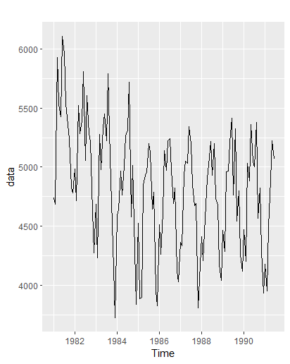
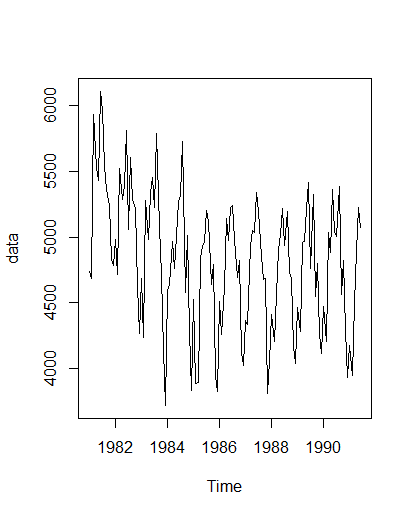
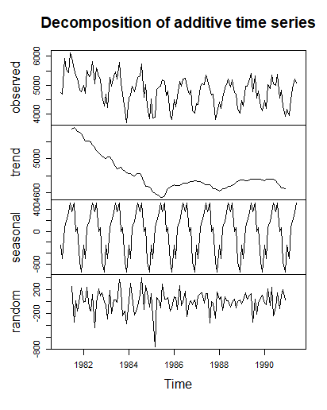
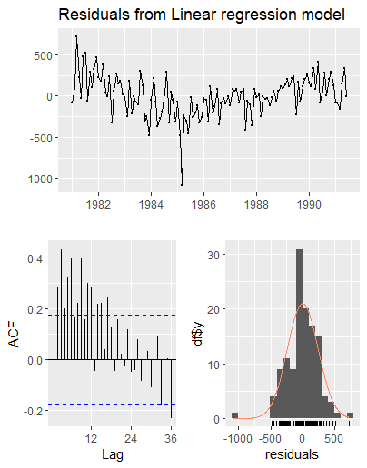
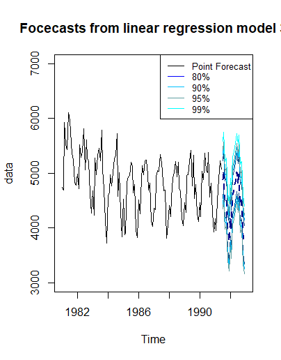
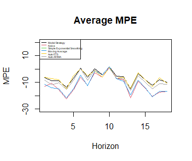

# Comprehensive Time Series Forecasting with the M3 Competition Dataset

This repository presents a detailed business analytics report on time series forecasting, leveraging statistical and machine learning models to analyze and predict future trends. The analysis includes exploratory data insights, forecasting model implementation, evaluation metrics, and actionable insights for industry applications.

## Dataset Overview

The dataset analyzed in this project originates from the Makridakis M3 Competition, a widely recognized benchmarking dataset for time series forecasting. It comprises diverse time series from industries such as finance, retail, and manufacturing, providing a robust basis for evaluating forecasting methods.

### Key Characteristics of the Dataset

#### 1. Time Series Distribution
The dataset includes 3003 time series distributed across six domains:
- **Micro**: Small-scale business data, including product-level sales.
- **Industry**: Manufacturing and production data.
- **Finance**: Economic indicators and stock market trends.
- **Demographics**: Population statistics, including births and deaths.
- **Macroeconomics**: National and global economic measures.
- **Others**: Miscellaneous series not categorized above.

#### 2. Time Frequencies
The dataset comprises time series with varying frequencies:
- **Yearly**: 645 series recorded annually.
- **Quarterly**: 756 series recorded quarterly.
- **Monthly**: 1428 series recorded monthly.
- **Other Frequencies**: Weekly, daily, and hourly series (a smaller portion).

Each time series includes:
- **In-sample Data (x)**: Historical observations used for training models.
- **Out-of-sample Data (xx)**: Future observations reserved for model evaluation.

---

## Time Series Forecasting Models

### Manual Forecasting

#### Data Exploration
Manual forecasting focused on **series 1910**, representing monthly glass container shipments from 1981 to 1992. Key observations from the data include:
- **Seasonality**: Monthly patterns were observed, with certain months consistently exhibiting higher or lower shipments.
- **Trends**: A slight downward trend was detected in earlier years.
- **Outliers**: Occasional spikes and dips suggest external influences on shipment volumes.

Exploratory visualizations:
- **ACF Plot**: 
- **Decomposition**: 

#### Forecasting Models

##### ARIMA (AutoRegressive Integrated Moving Average)
- **Strengths**: Robust for medium- and long-term predictions; handles non-stationary data effectively.
- **Forecast Visualization**: 

##### ETS (Exponential Smoothing State Space Model)
- **Strengths**: Effective for short-term forecasting with pronounced seasonality.
- **Forecast Visualization**: 

##### Regression Modeling
- **Residual Analysis**: 
- **Forecast Visualization**: 

---

### Batch Forecasting

#### Strategy Overview
Batch forecasting applied automated ARIMA and ETS models to 100 monthly time series extracted from the M3 dataset (series 1501–2500 ending in ‘9’).

#### Performance Evaluation
- **Evaluation Metrics (MAPE)**: 
- **Evaluation Metrics (MASE)**: 
- **Evaluation Metrics (MPE)**: 

---

## Conclusion

Forecasting provides critical insights for decision-making in various industries. This project demonstrates:
- Expertise in time series analysis and model selection.
- Application of advanced forecasting techniques to real-world datasets.
- Clear communication of results through comprehensive metrics and visualizations.

By combining manual and automated approaches, the analysis achieves high accuracy and scalability, showcasing the practical value of predictive analytics in business and beyond.
